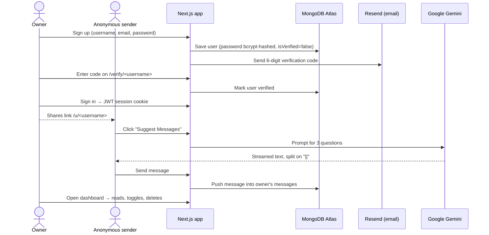

# True Feedback — Anonymous Messaging Platform

True Feedback is a full-stack web application where anyone can receive **anonymous messages** through a personal public link. A user signs up, verifies their email, and shares a link such as `https://yourdomain.com/u/alice`. Anyone who opens that link can send Alice a message without an account and without revealing who they are. Alice reads her messages on a private dashboard, can switch message intake on or off, and can delete messages she doesn't want.

To help senders who don't know what to write, the public page has an **AI "Suggest Messages" feature** powered by **Google Gemini**. It streams three friendly, open-ended conversation starters that the sender can pick with one click.

---

## Table of contents

1. [Features](#features)
2. [How it works — user flow](#how-it-works--user-flow)
3. [Architecture](#architecture)
4. [Technology stack and why each piece is used](#technology-stack-and-why-each-piece-is-used)
5. [Data model](#data-model)
6. [API reference](#api-reference)
7. [Security measures](#security-measures)
8. [Project structure](#project-structure)
9. [Running locally](#running-locally)
10. [Roadmap — future goals](#roadmap--future-goals)

---

## Features

| Feature | Description |
|---|---|
| **Sign up with email verification** | New users register with a username, email and password. A 6-digit code is emailed to them and must be entered within 1 hour to activate the account. |
| **Live username availability check** | While typing a username on the sign-up form, the app checks availability 300 ms after typing stops and shows the result instantly. |
| **Login with email or username** | One field accepts either identifier. |
| **Personal public link** | Every user gets `/u/<username>`, which anyone can open to send them a message. |
| **Anonymous sending** | Senders need no account; nothing identifying them is stored. |
| **AI message suggestions** | Google Gemini generates three conversation starters, streamed to the browser token by token. |
| **Private dashboard** | Shows received messages (newest first), the shareable link with a copy button, and a refresh button. |
| **Accept-messages toggle** | The owner can stop receiving messages at any time; the public page then refuses new messages. |
| **Delete messages** | With a confirmation dialog to prevent accidents. |
| **Route protection** | Signed-out users can't reach the dashboard; signed-in users are redirected away from login pages. |

---

## How it works — user flow



---

## Architecture

The whole application — frontend and backend — lives in a single **Next.js** project:

- **Frontend:** React pages under `src/app/`, rendered on the server first and then made interactive in the browser.
- **Backend:** Route Handlers under `src/app/api/*/route.ts`. Each file is an HTTP endpoint (`GET`, `POST`, `DELETE`) that runs on the server, talks to MongoDB and external services, and returns JSON.
- **Proxy (middleware):** `src/proxy.ts` runs *before* a page is rendered and redirects users based on whether they have a valid session token.
- **External services:** MongoDB Atlas (database), Resend (transactional email), Google Gemini (AI).

```
Browser ──► proxy.ts (auth redirects) ──► Page (React, server + client components)
   │                                          │
   └──── fetch("/api/...") ──► Route Handler ─┼──► MongoDB Atlas (Mongoose)
                                              ├──► Resend (verification email)
                                              └──► Google Gemini (AI suggestions)
```

Keeping one codebase means one deployment, shared TypeScript types and shared Zod validation schemas between the client and the server.

---

## Technology stack and why each piece is used

### Core framework

**Next.js 16 (App Router, Turbopack)**
Next.js is a React framework that adds routing, server rendering and a backend layer.
- **File-based routing:** a folder with `page.tsx` becomes a page (`src/app/u/[username]/page.tsx` → `/u/alice`). Square brackets create *dynamic segments*; parentheses such as `(auth)` and `(app)` are *route groups* that organise files and share layouts without affecting the URL.
- **Route Handlers:** `route.ts` files export functions named after HTTP methods. This replaces a separate Express server.
- **Proxy:** Next.js 16 renamed `middleware.ts` to `proxy.ts`. It runs on every matching request, and here it enforces authentication redirects before any page code runs.
- **Async `params`:** in this version, dynamic route parameters are a Promise (`const { messageid } = await params`), which the delete-message route follows.
- **Turbopack** is the Rust-based bundler used for fast development rebuilds and production builds.

**React 19** with the **React Compiler**
React builds the UI from components. The React Compiler (`babel-plugin-react-compiler`, enabled in `next.config.ts`) automatically memoises components, so the code doesn't need manual `useMemo`/`useCallback` everywhere for performance. Pages that need browser state (forms, the dashboard) are marked `'use client'`; the rest can render on the server.

**TypeScript 5**
Static typing across the whole stack. Examples: the `User` and `Message` Mongoose interfaces, the shared `ApiResponse` type that both API routes and pages use, and `next-auth.d.ts`, which extends NextAuth's session type with the custom fields `_id`, `username`, `isVerified` and `isAcceptingMessage`.

### Database

**MongoDB Atlas + Mongoose 9**
MongoDB is a document database; Atlas is its managed cloud service. Mongoose is an ODM (Object Document Mapper) that adds schemas, validation and typed models on top.
- `src/models/User.model.ts` defines a `User` schema with an embedded array of `Message` sub-documents. Embedding fits the current access pattern: messages are always read together with their owner, in one query.
- Schema-level validation: required fields, a unique username and email, email regex matching, and trimming.
- `src/lib/dbConnection.ts` caches the connection. Next.js may run a route many times in one process, and opening a new database connection per request would exhaust the connection pool.
- Uses atomic operators where they fit, e.g. `$pull` to remove one message from the array in a single update.

### Authentication

**NextAuth.js 4 (Credentials provider, JWT sessions)**
- `authorize()` in `src/app/api/auth/[...nextauth]/options.ts` looks the user up by **email or username**, rejects unverified accounts, and checks the password with bcrypt.
- **JWT strategy:** after login, the session is a signed, encrypted token in an HTTP-only cookie, so there's no session table in the database. The `jwt` and `session` callbacks copy `_id`, `username`, `isVerified` and `isAcceptingMessage` into the token so pages can use them without extra database queries.
- On the server, API routes call `getServerSession(authOptions)` to identify the user. On the client, `useSession()` (via the `SessionProvider` in `AuthProvider.tsx`) gives the navbar and dashboard the logged-in user.
- `proxy.ts` uses `getToken()` to read the same JWT for redirects.

**bcryptjs 3**
Passwords are never stored in plain text. They are hashed with bcrypt (cost factor 10), a deliberately slow, salted hashing algorithm that resists brute-force and rainbow-table attacks. Login compares the submitted password against the hash with `bcrypt.compare`.

### Validation

**Zod 4**
Zod schemas in `src/schemas/` define the rules once and reuse them in two places:
- **Client:** passed to React Hook Form through `zodResolver`, so users see errors instantly.
- **Server:** the API routes call `safeParse` on incoming JSON, so invalid data is rejected even if someone bypasses the UI.

Examples: usernames are 2–20 letters/numbers only; passwords 6–20 characters; messages 1–500 characters; verification codes exactly 6 characters.

### Email

**Resend 6**
A developer-focused transactional email API. `src/helpers/sendVerificationEmail.ts` sends the verification code from a verified custom domain (`RESEND_FROM_EMAIL`). The Resend SDK returns failures as an `error` value rather than throwing, so the helper checks it explicitly and reports a real failure to the user instead of a false success.

**React Email (JSX email template)**
The email body in `emails/verificationEmail.tsx` is written as a React component. Resend renders it to HTML, so emails are built with the same component model as the rest of the app.

### Artificial intelligence

**Vercel AI SDK 7 (`ai`, `@ai-sdk/google`, `@ai-sdk/react`) + Google Gemini**
- **Server** (`src/app/api/suggest-messages/route.ts`): `streamText()` sends a fixed prompt to the `gemini-3.5-flash-lite` model and returns `toTextStreamResponse()`, a plain-text HTTP stream. The key is passed explicitly with `createGoogleGenerativeAI({ apiKey: process.env.GEMINI_API_KEY })`.
- **Model configuration:** Gemini models "think" before answering by default. The thinking level is set to `low` because the task (three short questions) needs little reasoning; this keeps responses around 2 seconds and prevents reasoning tokens from consuming the output limit (`maxOutputTokens: 400`).
- **Output format:** the prompt asks for three questions separated by `||`, which the client splits into separate clickable buttons.
- **Client** (`src/app/u/[username]/page.tsx`): the `useCompletion` hook handles the request, streaming state, loading state and errors. Text appears as it is generated. If Gemini fails mid-stream (for example, a quota error), the reply is empty; the page detects this and shows a friendly error instead of a blank card.
- **Why the AI SDK:** it is provider-agnostic. Switching from OpenAI (used in the original tutorial) to Gemini changed one provider import and the model name; the streaming and React hook code stayed the same.

### User interface

**Tailwind CSS 4**
Utility-first CSS: styles are written as classes directly in the markup (`flex`, `bg-gray-800`, `md:grid-cols-2`), which keeps styling next to the component and makes responsive design easy with breakpoint prefixes. Version 4 is configured in CSS (`globals.css`) instead of a JavaScript config file.

**shadcn/ui on Radix UI primitives**
shadcn/ui isn't an installed component library; its CLI copies component source code into `src/components/ui/`, so the project owns and can edit every component. The components (Button, Card, Input, Textarea, Switch, AlertDialog, Carousel, Form, …) are built on **Radix UI** primitives, which provide accessibility out of the box: keyboard navigation, focus management and ARIA attributes. The delete confirmation, for example, is a Radix AlertDialog that traps focus and closes on Escape. The small `cn` package merges Tailwind classes without conflicts.

**React Hook Form 7 + @hookform/resolvers**
Manages form state without re-rendering the whole form on every keystroke, and connects to Zod through `zodResolver`. Used on the sign-up, sign-in, verify and send-message forms.

**Sonner**
Toast notifications for success and error feedback ("Message sent successfully", "Incorrect password", …).

**Embla Carousel + Autoplay**
Powers the auto-rotating sample-message carousel on the landing page.

**lucide-react**
SVG icon set (mail, refresh, spinner, delete icons).

**Day.js**
Lightweight date formatting for message timestamps (`Sep 25, 2026 3:36 PM`).

**next/font (Inter)**
Downloads the font at build time and serves it from the app's own domain: no layout shift and no request to Google Fonts at runtime.

### Tooling

**ESLint 9** with `eslint-config-next`, including the React Hooks and React Compiler rules. These caught real issues during development, such as state updates inside effects that could cause extra renders.

---

## Data model

```ts
User {
  _id: ObjectId
  username: string            // unique, 2–20 letters/numbers
  email: string               // unique, regex-validated
  password: string            // bcrypt hash, never plain text
  verifyCode: string          // 6-digit email code
  verifycodeExpiry: Date      // code valid for 1 hour
  isVerified: boolean         // must be true to log in
  isAcceptingMessage: boolean // owner's on/off switch
  messages: [
    { _id: ObjectId, content: string (1–500 chars), createdAt: Date }
  ]
}
```

Messages store **only** their text and a timestamp, with no sender information. That is how anonymity is guaranteed today: the data needed to identify a sender never exists.

---

## API reference

All endpoints return JSON shaped like `{ success: boolean, message?: string, ... }`.

| Method | Endpoint | Auth | Purpose |
|---|---|---|---|
| `POST` | `/api/sign-up` | – | Validate input, hash password, create or refresh an unverified user, email a 6-digit code |
| `GET` | `/api/check-username-unique?username=` | – | Check username format and availability (live check on sign-up) |
| `POST` | `/api/verify-code` | – | Check code and expiry, mark account verified |
| `POST` | `/api/auth/callback/credentials` | – | Login (handled by NextAuth) |
| `POST` | `/api/send-message` | – | Validate and deliver an anonymous message, if the recipient accepts messages |
| `POST` | `/api/suggest-messages` | – | Stream three AI-generated questions from Gemini |
| `GET` | `/api/get-message` | ✅ | Your messages, newest first |
| `GET` | `/api/accept-message` | ✅ | Your current accept-messages setting |
| `POST` | `/api/accept-message` | ✅ | Turn message intake on or off |
| `DELETE` | `/api/delete-message/:id` | ✅ | Delete one of your own messages |

Status codes are meaningful: `400` invalid input, `401` not signed in, `403` recipient not accepting messages, `404` not found, `500` server error.

---

## Security measures

- **Password hashing** with bcrypt; plain passwords are never stored or logged.
- **Email verification** required before login, with codes that expire after 1 hour.
- **Server-side validation** with Zod on every write endpoint; the client checks are for convenience only.
- **HTTP-only, signed JWT cookies**, which JavaScript in the page can't read, reducing XSS token theft.
- **Ownership checks:** delete, read and settings endpoints act only on the logged-in user's own document (`_id` taken from the server session, never from the request body).
- **Route protection** in `proxy.ts` before pages render.
- **Anonymity by design:** no sender data is collected.
- **Secrets** live in `.env` (excluded by `.gitignore`), never in the code.

---

## Project structure

```
src/
├── app/
│   ├── (app)/                  # Pages with the navbar
│   │   ├── layout.tsx          # Adds <Navbar />
│   │   ├── page.tsx            # Landing page with carousel
│   │   └── dashboard/page.tsx  # Private dashboard
│   ├── (auth)/                 # Full-screen auth pages
│   │   ├── sign-in/  sign-up/  verify/[username]/
│   ├── u/[username]/page.tsx   # Public send-message page + AI suggestions
│   ├── api/                    # Backend route handlers (see API reference)
│   ├── content/AuthProvider.tsx# NextAuth SessionProvider
│   └── layout.tsx              # Root layout: font, session, toasts
├── components/                 # Navbar, MessageCard, ui/ (shadcn components)
├── helpers/                    # sendVerificationEmail
├── lib/                        # DB connection, Resend client, utilities
├── models/                     # Mongoose User + Message schemas
├── schemas/                    # Zod validation schemas
├── types/                      # ApiResponse, NextAuth type extensions
└── proxy.ts                    # Auth redirects
emails/verificationEmail.tsx    # Email template (React)
```

---

## Running locally

**Requirements:** Node.js 20+, a MongoDB Atlas cluster, a Resend account with a verified domain, and a Google Gemini API key.

```bash
git clone https://github.com/ridowannhacked/annonimousMessageNextApp.git
cd annonimousMessageNextApp
npm install
```

Create a `.env` file in the project root:

```env
MONGODB_URI=mongodb+srv://<user>:<password>@<cluster>.mongodb.net/?appName=<app>
NEXTAUTH_SECRET=<long random string>        # e.g. openssl rand -base64 32
NEXTAUTH_URL=http://localhost:3000
RESEND_API_KEY=<your Resend key>
RESEND_FROM_EMAIL="True Feedback <no-reply@your-verified-domain.com>"
GEMINI_API_KEY=<your Google AI Studio key>
```

```bash
npm run dev      # development server at http://localhost:3000
npm run build    # production build
npm start        # run the production build
npm run lint     # ESLint
```

---

## Roadmap — future goals

### 1. Private two-way conversations (next major feature)

Today a message is a one-way note: the receiver can read it but can't respond, which limits the app's value. The next version turns each message into a **private conversation between exactly two people**:

- **Signed-in senders can see whom they messaged.** A new **"Sent"** page lists every message the user has sent and to whom, along with any reply.
- **The receiver can reply.** Each message on the dashboard gets a **Reply** button.
- **Only the two participants can see the thread.** Nobody else, including other visitors to the receiver's public page, can read the message or the reply.
- **The sender stays anonymous to the receiver.** The receiver sees "Anonymous" as before. The server knows the sender's account so it can route replies back, but it never sends that identity to the receiver.

**Planned design:**

- **Move messages into their own collection.** Messages are currently embedded inside the receiver's user document. Threads need to be queried from both sides ("messages I received" and "messages I sent"), and embedded arrays also count toward MongoDB's 16 MB document limit. The plan is a separate `Message` collection:

  ```ts
  Message {
    _id, recipientId (indexed), senderId? (indexed, private),
    content, createdAt,
    replies: [{ authorRole: "recipient" | "sender", content, createdAt }]
  }
  ```

- **Authorization rule:** a thread may be read only when `session.user._id` equals `recipientId` or `senderId`. It is enforced in every API route on the server, never in the UI alone.
- **Keeping the sender hidden:** API responses to the recipient omit `senderId` entirely, using a query projection so the field never leaves the database.
- **Guest senders:** people without an account can keep sending one-way anonymous messages. Optionally they get a secret, unguessable link (a random token, stored only as a hash) to check for a reply.
- **New endpoints:** `GET /api/sent-messages`, `POST /api/messages/:id/reply`, `GET /api/messages/:id` (thread view, participants only).
- **Notifications:** an email through Resend when a reply arrives; real-time updates later.

### 2. Safety and moderation

Anonymous platforms attract abuse, so these come alongside the conversation feature:
- **Rate limiting** on sending, per IP and per account, to prevent spam.
- **Report and block:** the receiver can block a sender's account without learning who it is.
- **AI content moderation:** reuse Gemini to flag hateful or harassing messages before they reach the inbox.

### 3. Quality and operations

- Automated tests: unit tests for Zod schemas and API routes, and end-to-end tests of the sign-up → send → reply flow.
- Pagination for large inboxes.
- "Resend code" and "forgot password" flows.
- Deployment on Vercel with CI running lint, type-check and tests on every pull request.
